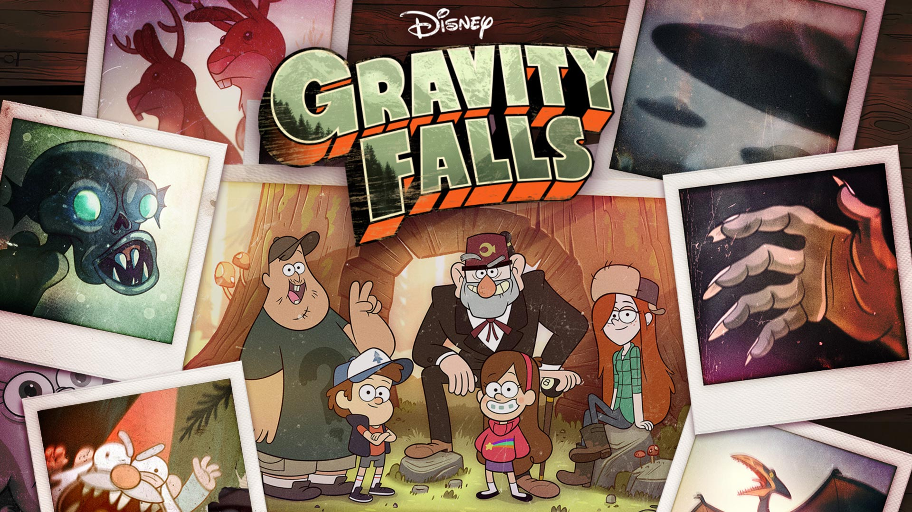

#**Gravity Falls**

*Twins Dipper and Mabel Pines are sent to spend the summer with their great-uncle, Grunkle Stan, in the mysterious town of Gravity Falls, Ore. Grunkle Stan has the kids help him run The Mystery Shack, the tourist trap that he owns. The twins try to adapt to the weird surroundings but sense there is something strange about Gravity Falls and begin to unlock its secrets. When Dipper uncovers a cryptic journal that offers insight into the town's mysteries, he and Mabel use it and their enthusiastic desire to vanquish evil to battle the imminent mysteries that surround them*

**The series has Two Seasons**

| Episode | Episode Title|
| --- | ----------- |
| S1EP1 | "Tourist Trapped" |
| S1EP2| "The Legend of the Gobblewonker" |
| S1EP3| "Headhunters" |
| S1EP4| 	"The Hand That Rocks the Mabel"|
| S1EP5| "The Inconveniencing" |
| S1EP6| "Dipper vs. Manliness" |
| S1EP7| "Double Dipper"	|
| S1EP8| "Irrational Treasure"	|
| S1EP9| "The Time Traveler's Pig"	 |
| S1EP10| "Fight Fighters" |
| S1EP11| "Little Dipper"	 |
| S1EP12| "Summerween"	 |
| S1EP13| "Boss Mabel" |
| S1EP14| 	"Bottomless Pit!" |
| S1EP15| "The Deep End" |
| S1EP16| "Carpet Diem" |
| S1EP17| "Boyz Crazy"|
| S1EP18| "Land Before Swine"|
| S1EP19| "Dreamscaperers" |
| S1EP20| "Gideon Rises" |

| Episode | Episode Title|
| --- | ----------- |
| S2EP1 | "Scary-oke"	 |
| S2EP2| "Into the Bunker" |
| S2EP3| "The Golf War" |
| S2EP4| 	"Sock Opera"	|
| S2EP5| "Soos and the Real Girl"	 |
| S2EP6| "Little Gift Shop of Horrors"	 |
| S2EP7| "Society of the Blind Eye"		|
| S2EP8| "Blendin's Game"		|
| S2EP9| "The Love God"	 |
| S2EP10| "The Love God"|
| S2EP11| "Not What He Seems"	 |
| S2EP12| "A Tale of Two Stans"	 |
| S2EP13| "Dungeons, Dungeons & More Dungeons"	 |
| S2EP14| "The Stanchurian Candidate" |
| S2EP15| "The Last Mabelcorn"	 |
| S2EP16| "Roadside Attraction"	 |
| S2EP17| "Dipper and Mabel vs. the Future"	|
| S2EP18| "Weirdmageddon Part 1"|
| S2EP19| "Weirdmageddon 2: Escape from Reality"	 |
| S2EP20| "Weirdmageddon 3: Take Back the Falls"|
